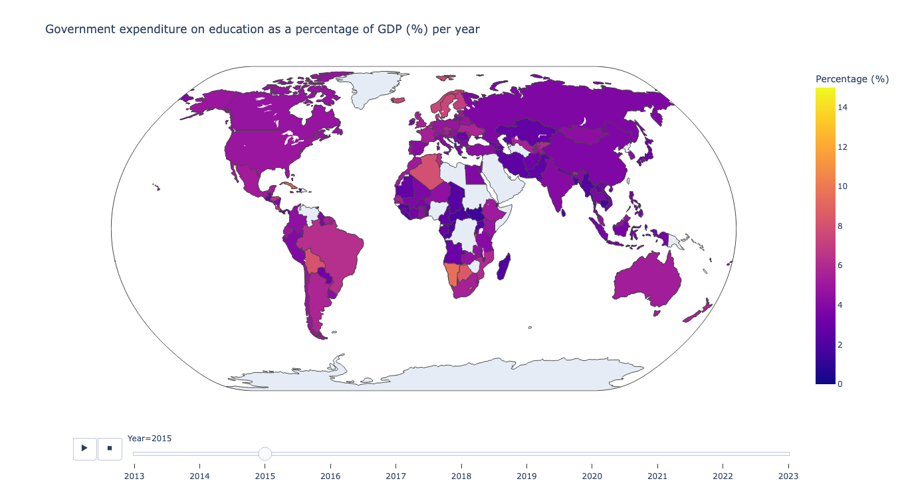

# SDG4-Global-Quality-Education
Overview of Sustainable Development Goal (SDG) 4: Quality education

A simple overview of SDG 4 indicator for countries from 2013 to 2023. In this project, we show government expenditure on education as a percentage of gross domestic product (GDP). The data is provided by the UNESCO Institute for Statistics.

# Usage
Please insure that you have conda and python installed before to run any command lines. Check the installation [here](https://docs.conda.io/projects/conda/en/latest/user-guide/install/index.html) if you don't have conda installed.

To run locally you need to activate the environment then run the command line as following : 
```
conda env create -f environment.yml
conda activate sdg4_env
cd src/
python main.py
```

# Output
The output will be saved in data folder. An interactive dashboard of global map GPD in html format, you can display the evolution of global GDP% <a href="https://htmlpreview.github.io/?https://github.com/DraceniY/SDG4-Global-Quality-Education/blob/main/data/Global_GDP_education.html" target="_blank">**here**</a>. 



# Interpretation 
We clearly see that the gross domestic product is not over 15.58% for all countries in the past 10 years (from 2023 to 2023). 

Kiribati represents the toppest GPD% in education with 15.58% in 2021. The Government of Kiribati announced $97 million over 12 years (2011-2023) in funding to the Kiribati Education Improvement Program (KEIP) to provide quality education to all i-Kiribati girls and boys, including children with a disability (1).

Missing data for most of countries starting 2021 (after pandemic) that can impact the reliability in the interpretation of results. 


Source : 
(1) - <a href="https://www.dfat.gov.au/about-us/publications/building-resilience-through-education-in-kiribati" target="_blank">Australian Government - Building Resilience through Education in Kiribati</a>

# Acknowledgement
I am thankful for the UNESCO Institute for Statistics for providing data. This project effort exemplifies the importance of open data practices.

Yasmine Draceni - January 2024 (c)
 